# Text classification

## Prerequests
> Python3.12 is used

1. Clone the reposiroty
```bash
git clone https://github.com/LukichevaPolina/nlp_lab.git
cd nlp_lab
```

2. Install requirements.txt
```bash
pip3 install -r requirements.txt
```

3. Set up `PYTHONPATH`
```bash
export PYTHONPATH=$PYTHONPATH:$PWD
```

## EDA
Dataset is taken from [kaggle](https://www.kaggle.com/datasets/suchintikasarkar/sentiment-analysis-for-mental-health/data), navigate to more description. To brief, dataset consist of two columns with `statement` and `status` name. The `status` is our target, which could take seven different value, so we deal with multiclass classification. The total amount of row is 53043, some of this rows are nan, so we remove them. It lead to 52681 appropriate rows. Below you could see the distribution of our targets(or classes).
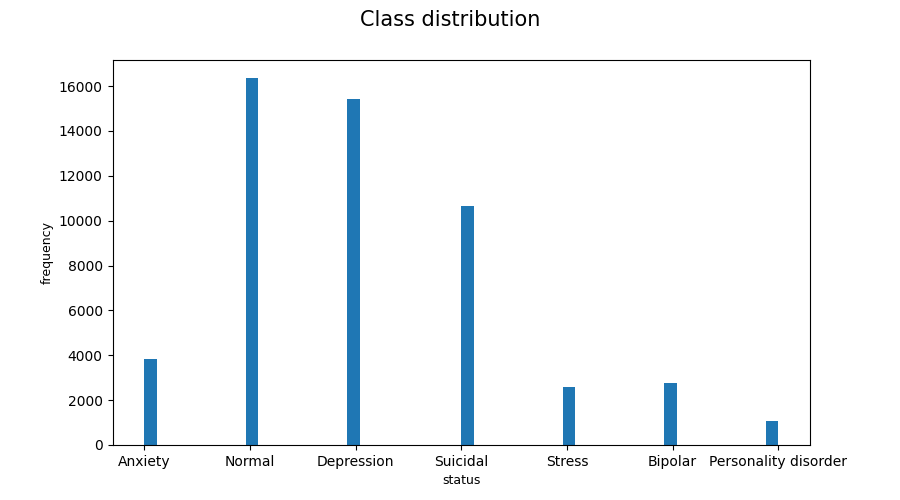

As you can see we have disbalanced classes, we deal with it using [class weight](https://scikit-learn.org/stable/modules/generated/sklearn.utils.class_weight.compute_class_weight.html) approach. Below we provide a little more statistics of our data.

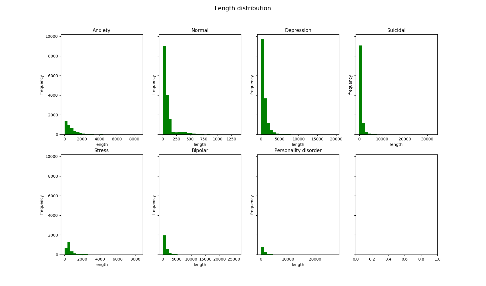
> The chart consist of histograms of the sentences length. Notice that a huge frequency corresponds to relative short sentences. A long sentences relate to Suicidal, Personality disorder, following by Anxiety, Depression, Bipolar and Stress. A smallest sentences belong to Normal.

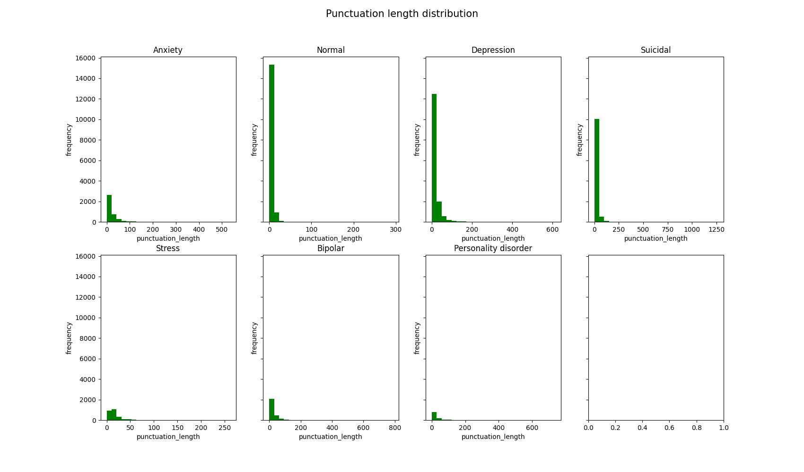
> The chart consist of histograms of the amount of punctuation (or punctuation length). Notice that the sentences include only one punctuation frequently.

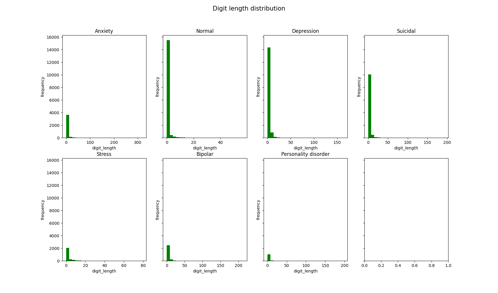
> The chart consist of histograms of the digit amount. Notice that more sentence have few digits.

We conclude that our data include short sentences around 5-50 words for `Normal`, around 1000-1500 of that for `Suicidal` and `Personality disorder`, about 500-600 of that for `Anxiety`, `Depression`, `Bipolar` and `Stress`, few punctuation and few digits. So the statistics say that `Suicidal` and `Personality disorder` people have a numerous thoughts, probably unnecessary. Notice also that almost all histograms are left shifted. 

Below we provide the histograms of more frequent words in our data.

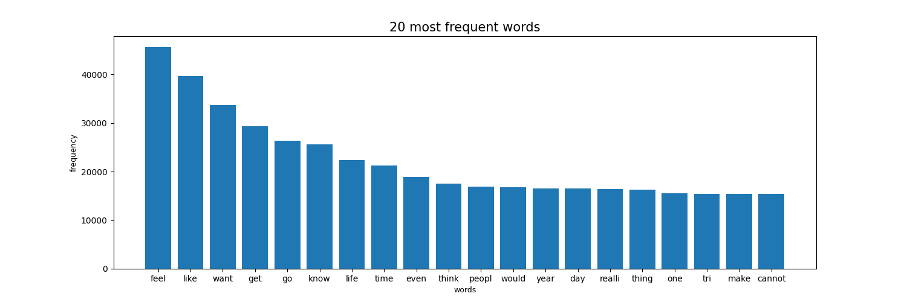
> The chart consist of histogram of the top 20 frequently words. The top 3 words are `feel`, `like`, `want`.

One of our preprocess include following steps: `drop_nan` -> `remove_punctuation` -> `remove_digits` -> `remove_stop_words` -> `tokenize` -> `stemming` -> `lemmatization`. The embeddings strategy is `tfidf`. We want to exam the four models: `svm`, `decision_tree`, `cnn` and `linear`.

## Classical algorithms
### SVM
**To train**
```bash
python3 main.py --dataset_path {dataset_path} --algorithm svm --embeddigns tfidf --class_balancer class_weight --preprocessor remove_all --mode train
```

**To eval**
```bash
python3 main.py --dataset_path {dataset_path} --algorithm svm --embeddigns tfidf --class_balancer class_weight --preprocessor remove_all --mode eval
```

#### Val metrics
| class | f1_score |
| ----- | -------- |
| 0     | 0.78     |
| 1     | 0.77     |
| 2     | 0.69     |
| 3     | 0.90     |
| 4     | 0.64     |
| 5     | 0.54     |
| 6     | 0.65     |

**accuracy** = 0.73, **f1_weighted** = 0.75

### Decision Tree

**To train**
```bash
python3 main.py --dataset_path {dataset_path} --algorithm decision_tree --embeddigns tfidf --class_balancer class_weight --preprocessor remove_all --mode train
```

**To eval**
```bash
python3 main.py --dataset_path {dataset_path} --algorithm decision_tree --embeddigns tfidf --class_balancer class_weight --preprocessor remove_all --mode eval
```

#### Val metrics
| class | f1_score |
| ----- | -------- |
| 0     | 0.59     |
| 1     | 0.58     |
| 2     | 0.58     |
| 3     | 0.78     |
| 4     | 0.50     |
| 5     | 0.32     |
| 6     | 0.52     |

**accuracy** = 0.57, **f1_weighted** = 0.62

### Comparing
Here need to add barplot consisted of svm: total f1 and accuracy, decision_tree: total f1 and accuracy

## DL algorithms
### CNN
**To train**
```bash
python3 main.py --dataset_path {dataset_path} --algorithm cnn --embeddigns tfidf --class_balancer class_weight --preprocessor remove_all --mode train
```

**To eval**
```bash
python3 main.py --dataset_path {dataset_path} --algorithm cnn --embeddigns tfidf --class_balancer class_weight --preprocessor remove_all --mode eval
```

#### Train metrics
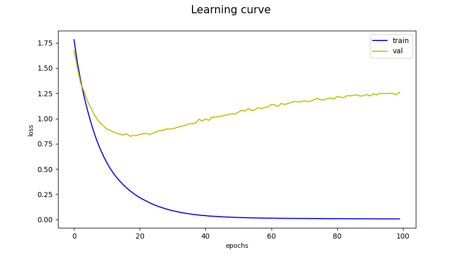 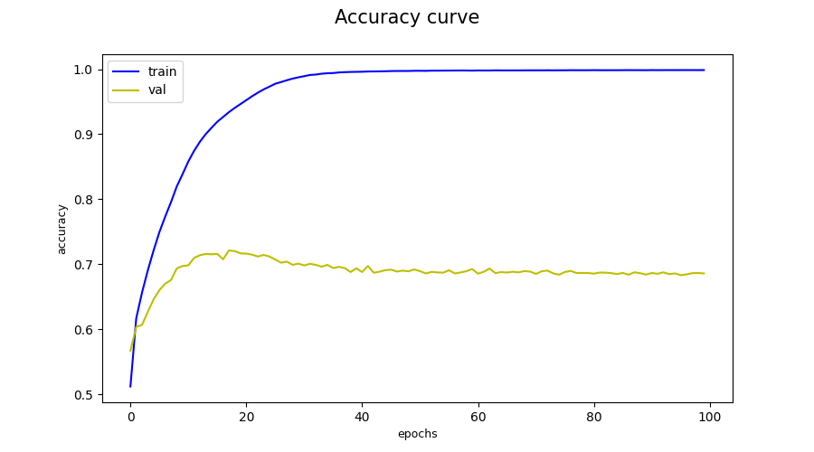 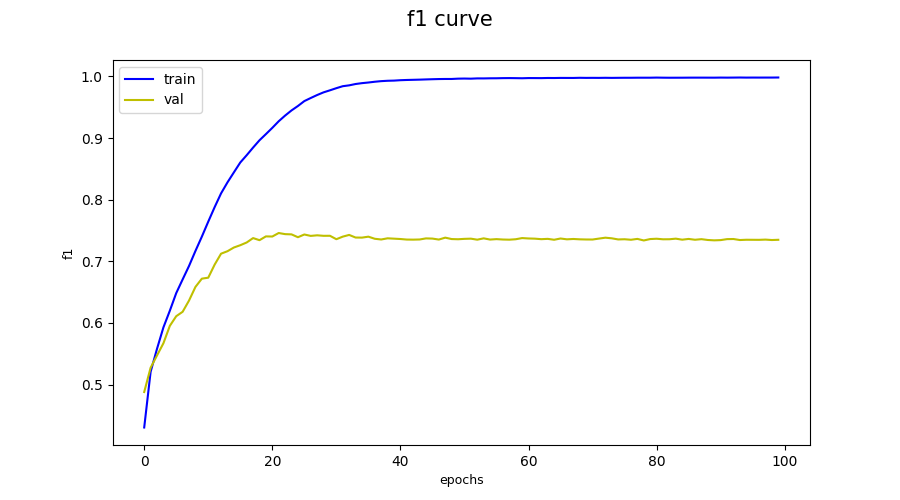

#### Val metrics
Here need to add report from `eval.py`: f1_score per classes, then total f1 and accuracy

### Linear
**To train**
```bash
python3 main.py --dataset_path {dataset_path} --algorithm linear --embeddigns tfidf --class_balancer class_weight --preprocessor remove_all --mode train
```

**To eval**
```bash
python3 main.py --dataset_path {dataset_path} --algorithm linear --embeddigns tfidf --class_balancer class_weight --preprocessor remove_all --mode eval
```

#### Train metrics
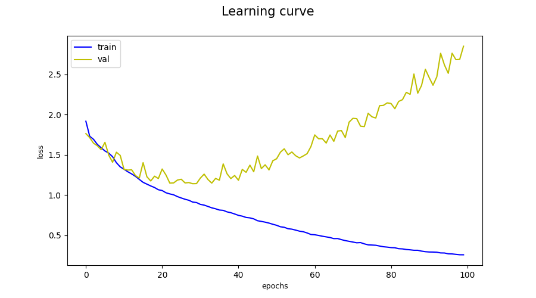 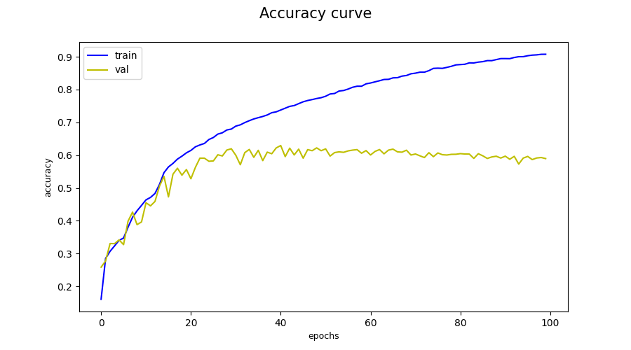 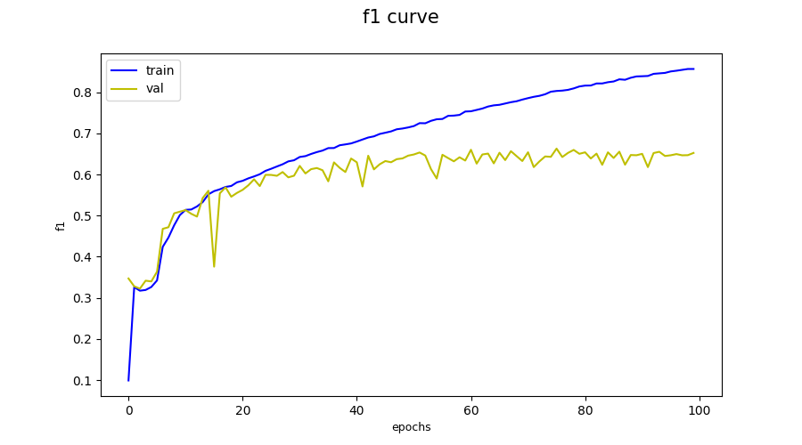

#### Val metrics
Here need to add report from `eval.py`: f1_score per classes, then total f1 and accuracy

### Comparing
Here need to add barplot consisted of cnn: total f1 and accuracy, linear: total f1 and accuracy

## Total Comparing
Here need to describe the results: which model is best and try to explain why